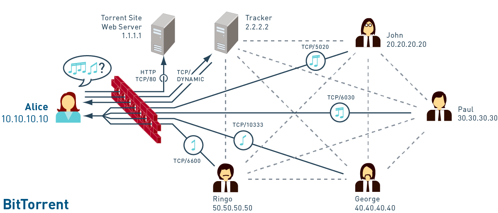

| 	|
| :--			|
| [BioTorrents.de tracker logo](https://biotorrents.de) |

# Introduction

Efficiently sharing biology data such as DNA, RNA, and protein sequences online is an open problem.
Repositories such as those that NCBI develops often serve gigabytes of data over FTP or HTTP from a content delivery network.
BitTorrent enables P2P transfers over UDP and supports RSS polling with automatic downloads. 

Private BitTorrent trackers are an ideal model to privately and securely share large amounts of data with integrity in a distributed way.
This paper describes my 2019 reimplementation of the [original 2010 BioTorrents site](https://doi.org/10.1371/journal.pone.0010071) with best-of-breed hentai and music tracker software.
All the links are safe for work.

BitTorrent trackers are kind of like air traffic controllers as the data piecemeal reaches its destination via seeders, who make it available by their own download progress.
Relevant features of private BitTorrent trackers for biology data include

- the ability to store and retrieve human readable annotations,
- the ability to easily download all or part of a given dataset,
- support for many diverse file formats and metadata fields,
- eliminating a single point of failure for data availability, and
- hashed data with citations, permalinks, and attribution.


# How to host a seedbox

If you have a server at your lab or home, and you expect to produce sequence data or bioinformatics studies, I humbly beseech you to host a seedbox.
It's a BitTorrent client daemon that other peers can reach 24/7 at a consistent port in the ephemeral range.

All peers connect over TCP to the [BioTorrents.de tracker reverse proxy](https://biotorrents.de) on port 443, which then directs peers to form UDP connections at specific ports.
This mitigates peer discovery leaks (e.g., disable UPnP) and removes traffic deprioritization on filtered ports.

[rTorrent](https://packages.debian.org/sid/rtorrent) and [Transmission](https://packages.debian.org/sid/transmission-daemon) are two good choices for seedbox software.
I like to [configure the BitTorrent client](https://interviewfor.red/en/torrenting.html) and set a login script to run `transmission-daemon(1)` and other programs.
rTorrent needs a [standalone web interface](https://wiki.archlinux.org/index.php/RTorrent#Web_interface) and Transmission includes its own.

I like to have the web interface listen on localhost, reverse proxy it through Nginx with TLS, and access it through SSH with a SOCKSv5 proxy.
Set Firefox to use `localhost:1080` or any unprivileged port and use the `ssh -D 1080` flag when you access the server.

Include `12.34.56.78 torrents.foo.com` in `/etc/hosts` on your personal laptop or add a DNS delegation to `127.0.0.1` on the server and proxy DNS through SOCKSv5.
[The NSD and Unbound pair](https://www.vultr.com/docs/running-nsd-and-unbound-on-openbsd-5-6) is an easy and popular way to scale a DNS zone to accommodate smart lab equipment.

The Nginx config below proxies requests for `https://torrents.foo.com` to [ruTorrent](https://github.com/Novik/ruTorrent) listening on `localhost:5000` with [security hardened headers](https://cipherli.st), saved as `/etc/nginx/conf.d/tls_params` or similar and included in the main `/etc/nginx/nginx.conf`.
Note that rTorrent itself runs in a tmux window.

```nginx
# Take note of http://wiki.nginx.org/Pitfalls
server {
	listen      443 ssl;
	server_name torrents.foo.com;

	ssl_certificate     /etc/ssl/torrents.foo.com.crt;
	ssl_certificate_key /etc/ssl/torrents.private/foo.com.key;

	access_log off;
	error_log  /var/log/nginx/torrents.foo.com-error.log;

	# https://docs.nginx.com/nginx/admin-guide/web-server/reverse-proxy
	location / {
		proxy_pass http://localhost:5000;
	}
}
```

Then from the web interface or on the command line you can create torrents with the private flag `-p` and the announce URL from the [BioTorrents.de upload page](https://biotorrents.de/upload.php).
The upload script sanitizes torrent files so you must download it from the site after uploading it, and open *that* copy in the client.

Please see an [iptables frontend](https://wiki.archlinux.org/index.php/Iptables#Front-ends) or the [OpenBSD pf docs](https://www.openbsd.org/faq/pf/rdr.html) to set up network address translation/port forwarding.
Note that you don't need the `rdr-to` phrase if you run pf on the seedbox itself.
Remember to also update your router settings to assign a static IP address to the seedbox and pass torrent traffic to it on the LAN.

Thank you for your interest in this project and for considering a seedbox at your lab or home.
It uses minimal CPU and RAM resources, and only intermittent bursts of bandwidth.


| 	|
| :--			|
| BitTorrent protocol data visualization from [Threestory Studio](http://www.threestory.com/projects/project-h) |


# System profile

## Debian 9

```shell
$ uname -a
Linux ohm 4.19.0-3-amd64 #1 SMP Debian 4.19.20-1 (2019-02-11) x86_64 GNU/Linux

$ nginx -v
nginx version: nginx/1.14.2

$ mysql -V
mysql  Ver 14.14 Distrib 5.7.25, for Linux (x86_64) using  EditLine wrapper

$ php -v 
PHP 7.3.2-3 (cli) (built: Feb  8 2019 15:05:54) ( NTS )
Copyright (c) 1997-2018 The PHP Group
Zend Engine v3.3.2, Copyright (c) 1998-2018 Zend Technologies
    with Zend OPcache v7.3.2-3, Copyright (c) 1999-2018, by Zend Technologies

$ indexer
Sphinx 2.2.11-id64-release (95ae9a6)                                           
Copyright (c) 2001-2016, Andrew Aksyonoff                                      
Copyright (c) 2008-2016, Sphinx Technologies Inc (http://sphinxsearch.com)     
```

First I changed the root password on the VPS as soon as it was installed.
Then I added a zone file to the domain registrar and an rDNS entry to the VPS host.

Germany's DENIC has implemented the [GDPR](https://gdpr-info.eu) for WHOIS queries on [`.de` domains](https://en.wikipedia.org/wiki/.de) since 2018-05-25.
Greece's FORTH has similar privacy protections on [`.gr` domains](https://en.wikipedia.org/wiki/.gr) but only because the WHOIS server returns a fatal error.
This seems like an unintended statement on the EU's international relations.

I upgraded Debian 9 to the unstable distribution by the [install FAQ's first method](https://wiki.debian.org/InstallFAQ).
Debian unstable is sadly inaccurately named in terms of bugs and uptime.
I also created `/etc/apt/apt.conf` as below.

```apt.conf
APT::Install-Recommends "1";
APT::Install-Suggests "0";
```

After rebooting the server I added personal and BitTorrent user accounts.
The BitTorrent user runs the Gazelle cron jobs and the Ocelot daemon, and owns all the site files.
Then I generated [strong SSH keys](https://wiki.archlinux.org/index.php/SSH_keys#Ed25519) and edited `/etc/sshd/sshd.conf` to deny passphrases and allow tunnelling.
After keying up the SSH server I added an `rsnapshot(1)` entry for BioTorrents.de on my backup server.

The last relevant setup details include hardening the `/etc/sysctl.conf` defaults, adding `noatime` to `/etc/fstab`, and installing an [`/etc/hosts` file](https://raw.githubusercontent.com/StevenBlack/hosts/master/hosts) that blocks tracking.
I made `/etc/motd` have [sexy ASCII art](motd) in honor of the Oppaitime hentai tracker admin Spaghetti, who helped me with good advice while I set up the tracker.


## Core networking

I implemented a DNSSEC validating, caching resolver with NSD and Unbound.
This is a popular (the default) combination on OpenBSD and it's easy to set up on Debian also.

First I installed NSD and Unbound and copied my OpenBSD configs to `/etc/nsd/nsd.conf` and `/etc/unbound/unbound.conf`, taking into account differences in UNIX socket, zone file, and root key locations.
Then I configured NSD to run on `localhost:8053` because DNS requests should hit Unbound first.

The Debian Unbound port doesn't seem to use UNIX sockets.
Then I installed `dnsutils` and edited `/etc/resolv.conf` to use `127.0.0.1`.
The test server [`dig pir.org +dnssec +multi`](https://docs.menandmice.com/display/MM/How+to+test+DNSSEC+validation) returned the expected `RRSIG` entry.
Subsequent lookups dropped from 407 ms to 0 ms.

The next step was to install a mail server so that Gazelle can send email from PHP for registration and passphrase recovery.
I installed OpenSMTPd and confirmed that PHP could send mail.
No other setup was necessary or desired because I already have a mail server.


## Gazelle and Ocelot

The Oppaitime tracker develops a [security hardened fork](https://git.oppaiti.me/Oppaitime/Gazelle) of the late What.CD's [Gazelle](https://github.com/WhatCD/Gazelle) software.
The PHP, MySQL, and Sphinx–powered web interface returns data on What.CD's [Ocelot](https://github.com/WhatCD/Ocelot), a daemon written in C++ that manages the peer swarm's activity.
First I made the necessary files and folders.

```shell
# nginx(8) log location
touch /var/log/nginx/{peerupdate.log,schedule.log}
chown www-data:adm /var/log/nginx/{peerupdate.log,schedule.log}

# files outside the web root
mkdir /var/www/pictures /var/www/torrents
chown www-data:adm /var/www/pictures /var/www/torrents
```

I downloaded [Oppaitime's Gazelle](https://git.oppaiti.me/Oppaitime/Gazelle.git) and [image proxy](https://git.oppaiti.me/Oppaitime/Image-Host.git) with Git.
Then I copied and edited `classes/config.php`.
It helped to set the below options in the beginning.

```php
define('DEBUG_MODE', true);
define('OPEN_REGISTRATION', true);
define('FEATURE_SET_ENC_KEY_PUBLIC', true);
```

[Oppaitime's Git wiki](https://git.oppaiti.me/Oppaitime/Gazelle/wiki/Crontab) includes a set of cron jobs that updates user stats and reindexes the site.
I added the entries below to the BioTorrents user's crontab and commented out the backup script because I already have a backup system in place.
 The PHP script keys come from `classes/config.php`.

```crontab
0,15,30,45 * * * * curl -s "localhost/schedule.php?key=$SCHEDULE_KEY" >> /var/log/nginx/schedule.log 2>&1
2-59/5 * * * * php /var/www/$SITE_NAME/peerupdate.php $PEER_UPDATE_KEY >> /var/log/nginx/peerupdate.log
* * * * * indexer -c /etc/sphinxsearch/sphinx.conf --rotate delta requests_delta >/dev/null 2>&1
7 * * * * indexer -c /etc/sphinxsearch/sphinx.conf --rotate torrents >/dev/null 2>&1
7 0,12 * * * indexer -c /etc/sphinxsearch/sphinx.conf --rotate --all >/dev/null 2>&1
#4 * * * * /usr/local/bin/backup
```

I keyed up the web application with `pwgen(1)` and `encrypt(3)` on OpenBSD for Blowfish hashes with about 300 bits of entropy each.
There's no reason to take MD5 hashes of files on disk, as in What.CD's guide, that may even be known to the tracker.


# Protocol

## Nginx and Certbot

I installed Nginx and Certbot according to the [Certbot guide](https://certbot.eff.org/lets-encrypt/debiantesting-nginx).

I copied the same config schema as on my OpenBSD servers: a bare minimum `/etc/nginx/nginx.conf` that includes each website and a shared security config.
There were certain inconsistencies such as `www-data` vs. `www` and different socket locations.
Then I added `certbot renew && systemctl restart nginx` to a daily cron job.

I paid particular attention to [Cipherli.st's security hardened headers](https://cipherli.st) and the [OWASP Secure Headers Project](https://www.owasp.org/index.php/OWASP_Secure_Headers_Project).
The goal was to achieve a perfect score on the [Qualys SSL server test](https://www.ssllabs.com/ssltest/analyze.html?d=biotorrents.de&s=51.68.175.209&hideResults=on).
Web server security moves fast so I read grey hat news as part of my security posture.


## PHP and memcached

Oppaitime's Gazelle features many security improvements such as decrypting the database in memory, supporting 2FA and U2F, sanitizing `.torrent` metadata, proxying images, and using evergreen hash functions.
This required a modified PHP installation with several extensions.

I installed the dependencies with the command below.
Note that neither memcached nor MySQL had a daemon listening at this point.

```shell
apt install php php-apcu php-fpm php-mbstring php-memcache php-mysql
```

I ensured that `short_open_tag = On` in `/etc/php/7.3/*/php.ini`.
I diverged from [What.CD's Gazelle guide](https://github.com/WhatCD/Gazelle/wiki/Gazelle-Installation-from-scratch-with-Gentoo#configure-nginx) and used socket communication.
PHP-FPM needed larger buffers to serve requests without 502 errors.

```nginx
# pass the PHP scripts to FastCGI server listening on unix socket
location ~ \.php$ {
	try_files     $uri $uri/ =404;
	fastcgi_pass  unix:/var/run/php/php7.3-fpm.sock;
	fastcgi_index index.php;
	fastcgi_param SCRIPT_FILENAME $document_root$fastcgi_script_name;
	include       fastcgi_params;

	# https://stackoverflow.com/a/23845727
	fastcgi_buffers     16 16k;
	fastcgi_buffer_size 32k;
}
```

I installed memcached and edited `/etc/memcached.conf` by the diff below.
I ensured that the socket location matched `classes/config.php`.

```diff
$ diff /etc/memcached.conf /etc/memcached.conf~
26c26
< #-p 11211
---
> -p 11211
35c35
< #-l 127.0.0.1
---
> -l 127.0.0.1
51,56d50
<
< # https://github.com/WhatCD/Gazelle/wiki/Gazelle-Installation-from-scratch-with-Gentoo#start-memcached
< -s /var/run/memcached/memcached.sock
< -a 0777
< -t 16
< -C
```

The site's many errors didn't bother me at this point.
Many moving parts fell into place as I iterated over the setup process.


## MariaDB and the Gazelle database

I installed MariaDB and initialized it with `mysql_secure_installation`.
Then I imported the default database and [created a BioTorrents user](https://dev.mysql.com/doc/refman/8.0/en/adding-users.html) to manage it.

```sql
SOURCE /var/www/html/biotorrents.de/gazelle.sql;
CREATE USER 'biotorrents'@'localhost' IDENTIFIED BY 'pwgen -s | encrypt';
GRANT ALL PRIVILEGES ON `gazelle_development`.* TO 'biotorrents'@'localhost';
```

I also had to disable the `ONLY_FULL_GROUP_BY` mode in `/etc/mysql/my.cnf` to clear errors on the Forums and Stats pages.
I found no compelling evidence to suggest this was a security risk.

```ini
# https://johnemb.blogspot.com/2014/09/adding-or-removing-individual-sql-modes.html
[mysqld]
sql_mode = "STRICT_TRANS_TABLES,NO_ZERO_IN_DATE,NO_ZERO_DATE,ERROR_FOR_DIVISION_BY_ZERO,NO_AUTO_CREATE_USER,NO_ENGINE_SUBSTITUTION"
```

[The MySQL Utilities](https://packages.debian.org/sid/mysql-utilities) provided helpful tools to avoid too many SQL queries.


## Sphinx and indexing

Sphinx is a full-text search engine for the major FOSS relational databases that also powers Craigslist.
I installed it and used the `/etc/sphinxsearch/sphinx.conf` example in [Oppaitime's Git wiki](https://git.oppaiti.me/Oppaitime/Gazelle/wiki/Sphinx-Config).
Note that Debian's Sphinx locations differ somewhat from Oppaitime's example.

I also had to prepare the Sphinx user's home folder `/var/run/sphinxsearch` and make an init script.
I made `/etc/systemd/system/searchd` with the script below and made it executable.

```shell
#!/bin/sh

case "$1" in
	start)
		/usr/bin/searchd
		;;
	stop)
		/usr/bin/searchd --stop
		;;
	restart)
		/usr/bin/searchd --stop && /usr/bin/searchd
		;;
	*)
		echo "Usage: $SELF {start|stop|restart}"
		exit 1
		;;
esac
```

Finally I had to make `/etc/systemd/system/searchd.service` by the [Debian wiki's example](https://wiki.debian.org/systemd/Services).
To enable it on boot I did `systemctl daemon-reload` and `systemctl enable searchd.service`.

```ini
[Unit]
Description=Fast standalone full-text SQL search engine
After=network.target

[Service]
Type=forking
Restart=always
ExecStart=/etc/systemd/system/searchd

[Install]
WantedBy=multi-user.target
```

This let me manage the Sphinx daemon with standard system tools.


## Building and installing Ocelot

I downloaded [What.CD's Ocelot](https://github.com/WhatCD/Ocelot.git) with Git and consulted the [readme](https://github.com/WhatCD/Ocelot/blob/master/README.md).
Then I installed the dependencies as below.

```shell
apt install \
	automake \
	g++ \
	gcc \
	libboost-dev \
	libboost-iostreams-dev \
	libboost-system-dev \
	libev-dev \
	libmysql++-dev \
	libtcmalloc-minimal4 \
	make
```

I performed the ritual of compilation and humbly took the wafer and the wine.
Note that I needed to run `autoreconf(1)` and manually set the library locations to prepare the environment.

```shell
cd /tmp/Ocelot/
autoreconf
./configure \
	--with-boost-libdir=/usr/lib/x86_64-linux-gnu \
	--with-ev-lib=/usr/lib/x86_64-linux-gnu \
	--with-mysql-lib=/usr/lib/x86_64-linux-gnu \
	--with-mysqlpp-lib=/usr/lib/x86_64-linux-gnu
make
make install
```

Then I copied and edited `Ocelot/ocelot.conf.dist`.
The daemon runs on `localhost:34001` and Nginx reverse proxies it to `localhost:34000` with TLS.
`ocelot.conf` lives in the BioTorrents user's home folder and the daemon runs in a tmux window there.


## Fine tuning Gazelle

I took a deep breath and ate dark chocolate and drank red wine.
It all began to fall into place even though I had no oysters.

It was very important to disable `DEBUG_MODE` and `FEATURE_SET_ENC_KEY_PUBLIC` as soon as I registered the admin account!
Gazelle's 2FA implementation required `qrencode(1)`, so I installed it and enabled 2FA on the admin account.

I configured a client whitelist on the Toolbox page by the [BitTorrent spec's peer ID list](https://wiki.theory.org/index.php/BitTorrentSpecification#peer_id).
The tracker only allows high quality, open source clients at the latest major version.
Note that LibTorrent 0.1x.y also covers rTorrent/ruTorrent and other clients that use [rakshasa's library](https://github.com/rakshasa/libtorrent).

| Client Name		| Peer ID	|
| :--			| :--:		|
| Deluge 1.x.y		| `-DE1`	|
| KTorrent 5.x.y	| `-KT5`	|
| LibTorrent 0.1x.y	| `-lt01`	|
| Transmission 2.xy	| `-TR2`	|
| qBittorrent 4.x.y	| `-qB4`	|

Then I used the Toolbox to configure the forums and flatten the user classes.
The idea was to take all the fun and exclusivity out of it and to flount the conventions of private media piracy BitTorrent trackers.
Ratio rules still apply and members are expected to give back by seeding downloaded torrents for as long as possible.


## Further development

BioTorrents.de is under active development.
[Please see the Git repo](https://pjc.is/biotorrents/gazelle) for more information.
Besides making the site look and act less like an anime porn tracker, two specific challenges include adding NCBI autocomplete functionality and updating the image proxy to serve DOI numbers via Sci-Hub.
